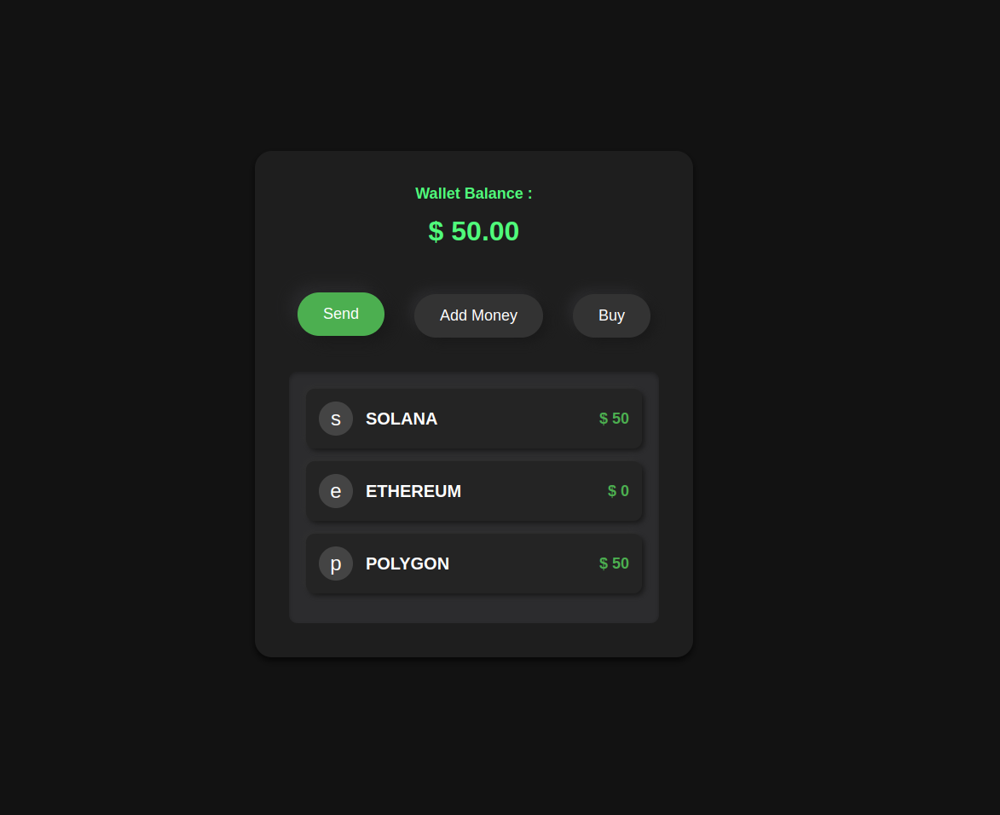

# Solana Shift Pay

Solana Shift Pay is a web3-based application designed to facilitate international transactions using the Solana blockchain. By leveraging Solana's high-speed and low-cost transaction capabilities, Solana Shift Pay aims to reduce transfer fees and transaction times associated with traditional international payments.

## Features

- **Fast Transactions:** Utilizing Solana's high throughput, transactions are processed quickly, enabling near-instantaneous transfers.
  
- **Low Transaction Fees:** Solana's low transaction fees make international payments more affordable compared to traditional banking systems.
  
- **Transparent:** Transactions on the Solana blockchain are transparent and can be easily tracked on the blockchain explorer.
  
- **Secure:** Solana's robust security features ensure that transactions are secure and immutable.

## Getting Started

To get started with Solana Shift Pay, follow these steps:

1. **Install Dependencies:** Ensure that you have Node.js and npm installed on your system.

2. **Clone the Repository:** Clone the Solana Shift Pay repository from GitHub:  git clone https://github.com/thatspiyush08/SolanaSwiftPay.git

3. **Install Packages:** Navigate to the project directory and install the necessary dependencies:

## Usage

1. **Connect Wallet:** Connect your Solana wallet to the application. If you don't have a Solana wallet, you can create one using our platform.

2. **Initiate Transaction:** Enter the recipient's wallet address and the amount you wish to transfer.

3. **Confirm Transaction:** Review the transaction details and confirm the transfer.

## Images

## Contributing

Contributions to Solana Shift Pay are welcome! To contribute, follow these steps:

1. Fork the repository.

2. Create a new branch for your feature or bug fix.

3. Make your changes and ensure that the code passes all tests.

4. Commit your changes and push them to your fork.

5. Submit a pull request with a detailed description of your changes.

## Acknowledgements

- Solana - for providing a high-performance blockchain platform.
- Web3.js - for enabling interactions with the Solana blockchain.
- React - for building the user interface of the application.

